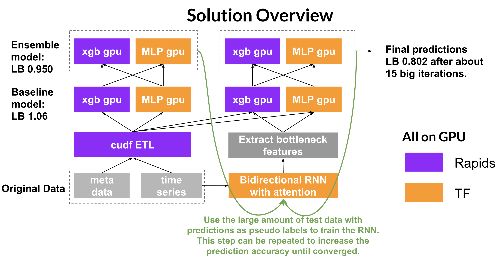

## <div align="left"></div> Open GPU Data Science

# Introduction
This repo contains 8th place [Rapids.ai](https://rapids.ai) solution of [PLAsTiCC Astronomical Classification](https://www.kaggle.com/c/PLAsTiCC-2018). 

# Setup
## Requirement
1. cuda>=9.2
2. anaconda

## Install depencencies
```bash
$ conda create -n cudf-latest python=3.6
$ source activate cudf-latest
$ conda install -c nvidia -c rapidsai -c numba -c conda-forge -c defaults cudf=0.4.0
$ pip install xgboost
$ pip install scikit-learn
$ conda install jupyter notebook
```

# Rapids demo notebook
```bash
$ cd notebooks
$ jupyter notebook
$ rapids_lsst_demo.ipynb
```

## to be continued.

<p align="center"></p>
